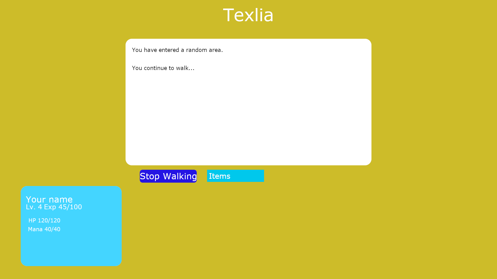
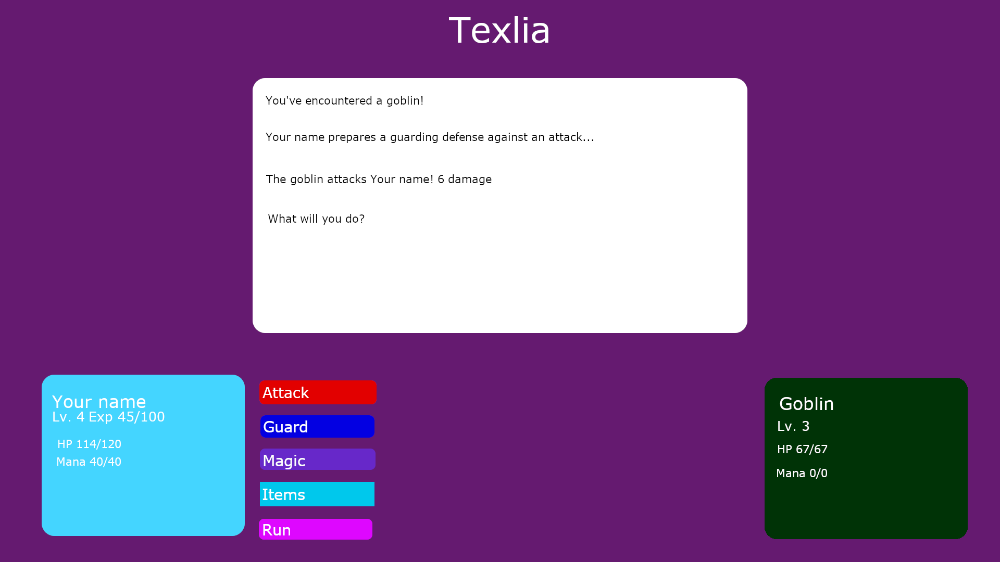
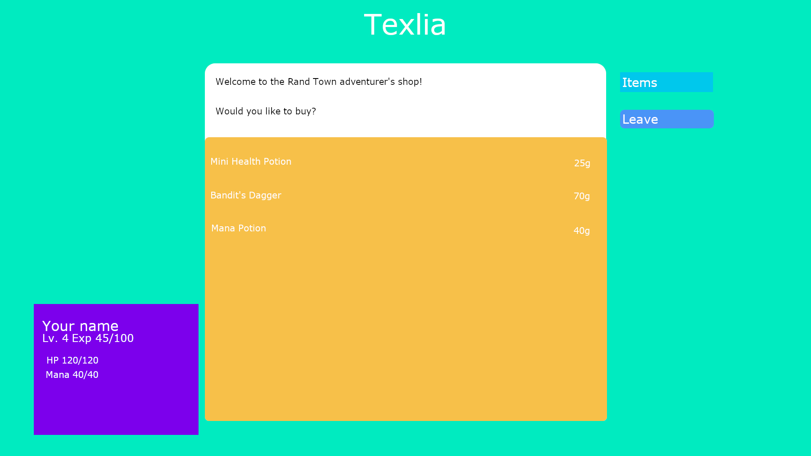
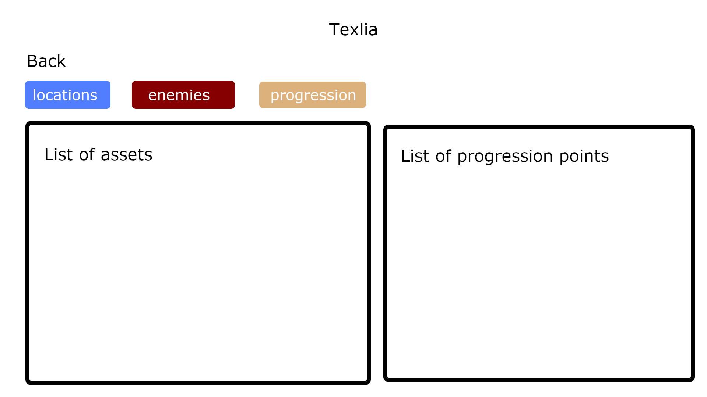
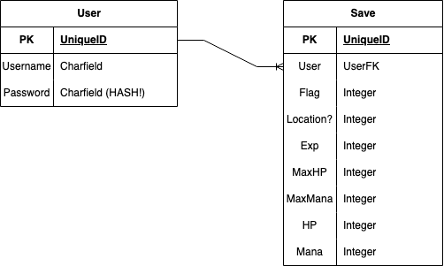

# Tavlia
A user, browser, and text-based RPG.

## How?
Using a Django-Python-powered CRUD/REST API to manage data, like campaigns, campaign assets, save data, and users, and a React-TypeScript frontend to display and play, this game will aim to be robust and dynamic and allowing for user-creativity and sharing.

# Design

## User Stories

### MVP

For the MVP, there will be one main sample campaign.

As a user, I want to be able to:
- [ ] Be able to save my progress for the campaign so I can play at my own pace without having to play and complete campaigns in one sitting
- [ ] Have my saves linked to my user account so no one else can alter my saves without my permission

### Stretch/Extra

For an expanded version of this project, campaigns could be created by users.
Therefore, a user could be a creator, who creates assets and campaigns, and/or a player, who plays through campaigns.

As a creator, I want to be able to:
- [ ] Create assets in order to give my own flavor to my campaigns, including:
    - [ ] Locations, like towns, adventure fields, and assets
    - [ ] Shops      
    - [ ] Items, like weapons and heals
    - [ ] Enemies
    - [ ] Skills/Attacks
- [ ] Be able to string assets together into my own campaign
- [ ] Share assets in order to help other creators save time making their own assets as well as allow them to make new creations on top of my own

As a player, I want to be able to:
- [ ] Be able to play through published campaigns
- [ ] Save my progress on each campaign so I can play at my own pace without having to play and complete campaigns in one sitting
- [ ] Share my saves so others can play from when I last left off or create my own 'gamemodes' on top of campaigns
- [ ] Download my saves locally so I can back them up

## Milestones
### MVP
- [ ] Basic campaign complete
- [ ] Basic playable frontend
- [ ] User Auth complete
- [ ] Save functionality complete

### Stretch
- [ ] Assets CRUD on backend
    - [ ] Locations CRUD complete
    - [ ] Enemies CRUD complete
    - [ ] Items CRUD complete
    - [ ] Skills/Attacks complete
- [ ] Campaign creation CRUD
- [ ] Playable user-created campaigns
- [ ] Save files for each UCC

## Wireframes
Adventure Screen:

Battle Screen:

Shop Screen:

Campaign Creation Screen (Stretch!):

## Entity Relationship Diagrams
### MVP

